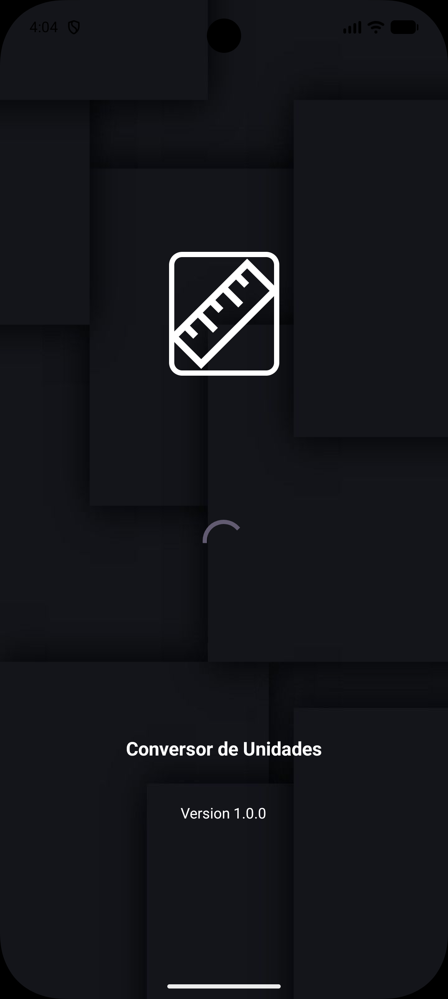
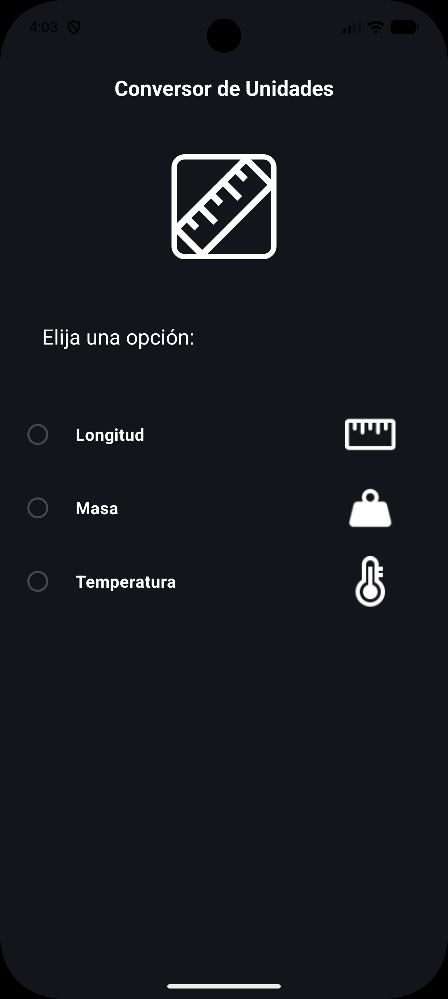
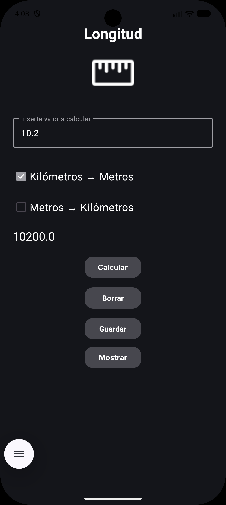
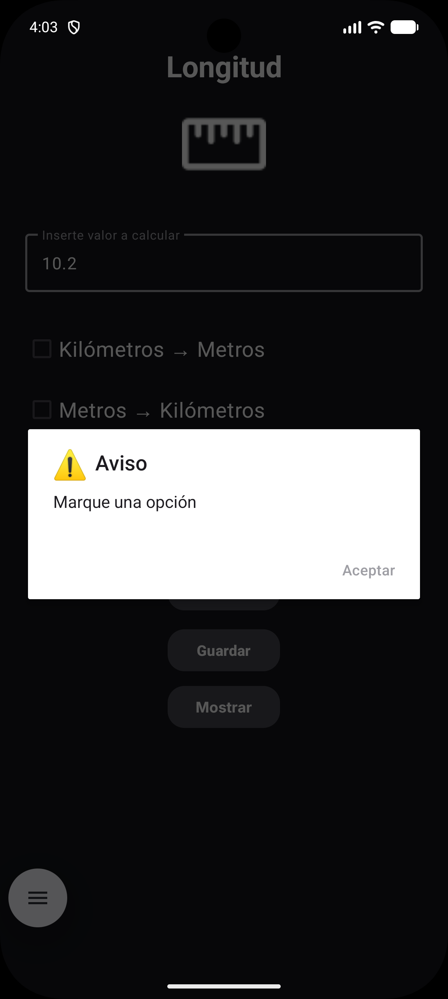

# Conversor de Unidades

**Conversor de Unidades** es una herramienta práctica y minimalista diseñada para facilitar la conversión rápida entre magnitudes de longitud, masa y temperatura. 

Este proyecto nació con el objetivo de aplicar los fundamentos de desarrollo nativo en Android, centrándose en la **experiencia de usuario (UX)**, la **robustez en la entrada de datos** y el cumplimiento de las guías de diseño de **Material Design**.

## 🚀 Características

*   **Pantalla de Bienvenida (Splash Screen):** Inicio fluido con una imagen personalizada.
*   **Selector de Categorías:** Pantalla principal con botones de opción (`RadioButtons`) para elegir el tipo de conversión.
*   **Conversiones Soportadas:**
    *   **Longitud:** Kilómetros a metros y viceversa.
    *   **Masa:** Kilogramos a gramos y viceversa.
    *   **Temperatura:** Celsius a Fahrenheit y viceversa.
*   **Persistencia de Datos:** Permite guardar el último resultado obtenido utilizando `SharedPreferences` para consultarlo más tarde.
*   **Gestión de Errores:** Validaciones integradas con avisos visuales (`AlertDialog`) si no se ingresan valores o no se selecciona una unidad.
*   **Interfaz Moderna:** Uso de `Edge-to-Edge` para aprovechar toda la pantalla, botones de borrado y recuperación de datos, y componentes de Material Design.
*   **Tipografía Personalizada:** Implementación de la fuente *Inter* para una mejor legibilidad.

## 💎 Aspectos Destacados del Desarrollo

*   **Robustez de Datos:** Implementación de normalización de entradas numéricas (manejo de separadores decimales `.` y `,`) para evitar excepciones y mejorar la compatibilidad regional.
*   **Persistencia Eficiente:** Gestión de estados y preferencias de usuario mediante `SharedPreferences` con claves independientes por categoría.
*   **UI/UX:** Interfaz inmersiva con soporte nativo para `Edge-to-Edge`, componentes de `Material 3` y feedback visual mediante diálogos de alerta personalizados.
*   **Arquitectura Limpia:** Código organizado por actividades con lógica desacoplada y gestión eficiente del stack de navegación.

## 🛠️ Tecnologías Utilizadas

*   **Lenguaje:** Java 11.
*   **Plataforma:** Android (SDK Mínimo: 24, SDK Objetivo: 36).
*   **Interfaz de Usuario:** XML Layouts con `ConstraintLayout` y Material Components.
*   **Gestor de Dependencias:** Gradle (Kotlin DSL).

## 📂 Estructura del Proyecto

El proyecto sigue la estructura estándar de una aplicación Android:

*   `app/src/main/java`: Contiene la lógica en Java (Activities, Helpers).
*   `app/src/main/res/layout`: Definición de las pantallas en XML.
*   `app/src/main/res/values`: Recursos de cadenas, colores, temas y estilos.
*   `app/src/main/res/font`: Fuentes personalizadas (Inter).

## 📸 Capturas de Pantalla

| Splash Screen | Menú Principal | Conversión | Gestión de Errores |
|:---:|:---:|:---:|:---:|
|  |  |  |  |

## 📦 Instalación y Uso

1.  Clona este repositorio.
2.  Abre el proyecto en **Android Studio**.
3.  Sincroniza el proyecto con los archivos Gradle.
4.  Ejecuta la aplicación en un emulador o dispositivo físico con Android 7.0 (API 24) o superior.

---
Desarrollado por **Inma González**.
